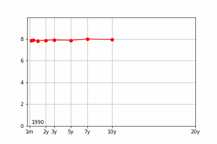

# yieldcurve-animation

Made just to check how hard it would be to create this. Probably easier to save the frames seperately and use other software to create the actual gif. Data obtained from <a href='https://www.treasury.gov/resource-center/data-chart-center/interest-rates/pages/textview.aspx?data=yield'>treasury.gov</a>

